# Graphical User Interface Prototype - CURRENT

Authors: Meelad Dashti, Mohammed El Dor, Narimanova Tomiris ,Setareh Neshatdoust

Date: 27.04.2024

Version: 1. 0

# LOGIN PAGE
From here the User can enter Username, Password.
 <!-- blank line -->
1. Click the "Log In" button to go to the [PRODUCT LIST PAGE](#product-list-page)
2. Click the "Create new account" button to go to the [REGISTRATION PAGE](#registration-page)
 <!-- blank line -->
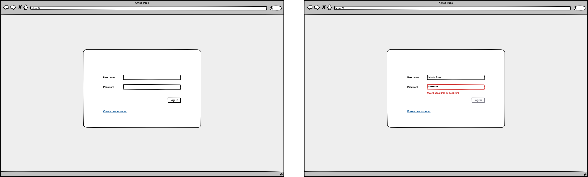
# REGISTRATION PAGE
The non-registered User enters required fields, select user role (Customer or Manager) to create an account.
 <!-- blank line -->
1. Click the "Sign In" button to go to the [LOGIN PAGE](#login-page)
2. Click the "Create new account" button to go to the [PRODUCT LIST PAGE](#product-list-page)
 <!-- blank line -->
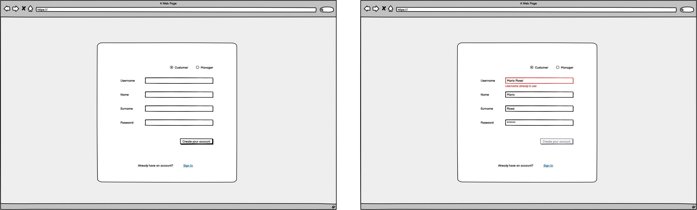
# USER Information
<!-- blank line -->
1. Click the profile icon to see the user information
 <!-- blank line -->
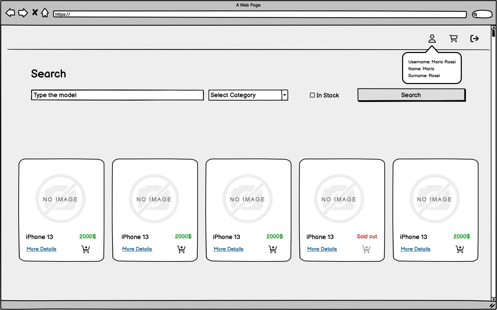
# PRODUCT LIST PAGE
A list of all products. The user can search the model, select category and use filter "in stock".
<!-- blank line -->
1. Click on the product to go to [PRODUCT PAGE](#product-page)
 <!-- blank line -->
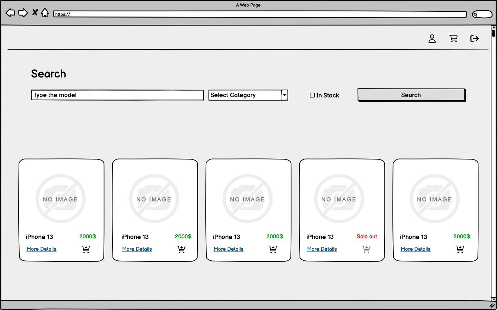
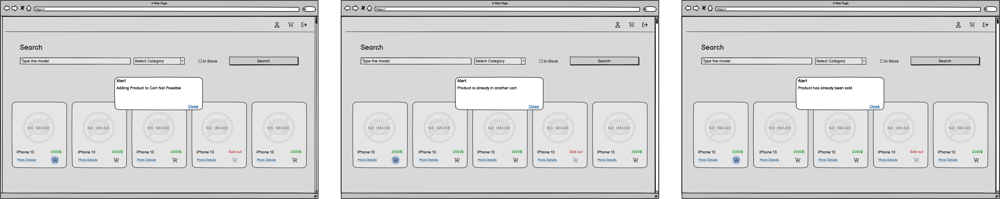
# PRODUCT PAGE
<!-- blank line -->
1. Click the cart icon to add the product to the cart
2. Click the cart icon in the header of the website to go to [CART PAGE](#cart-page)
 <!-- blank line -->
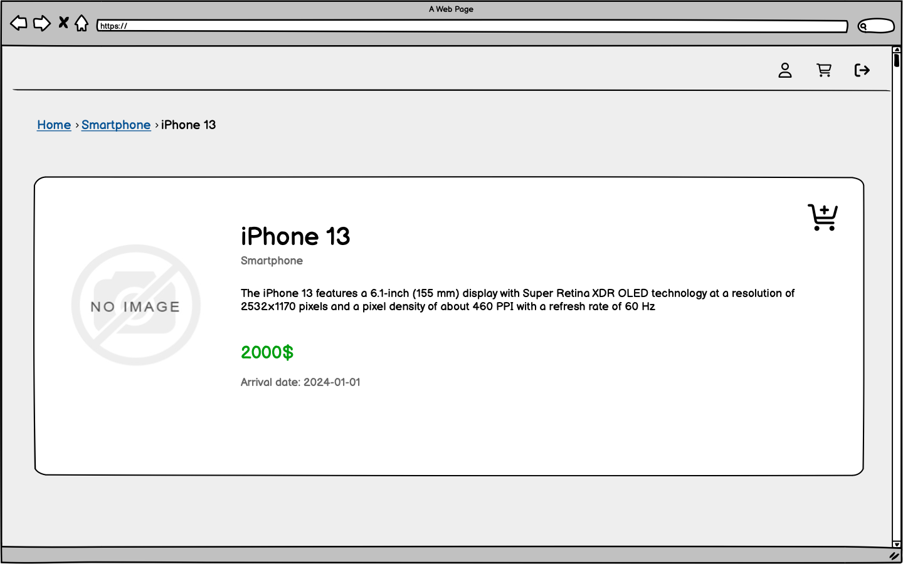
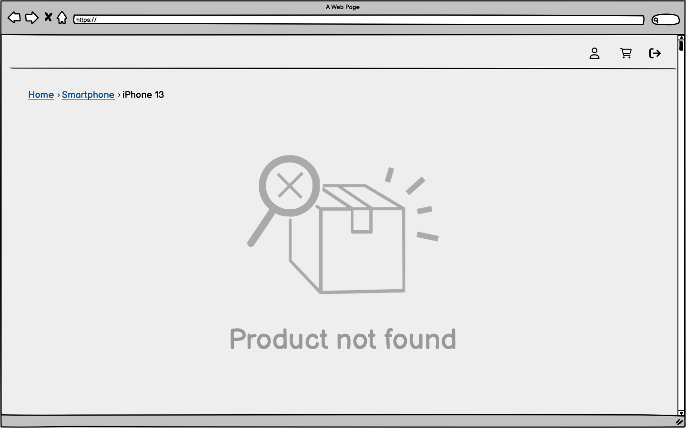
# CART PAGE
<!-- blank line -->
1. Click "Pay" button to pay the current cart
<!-- blank line -->
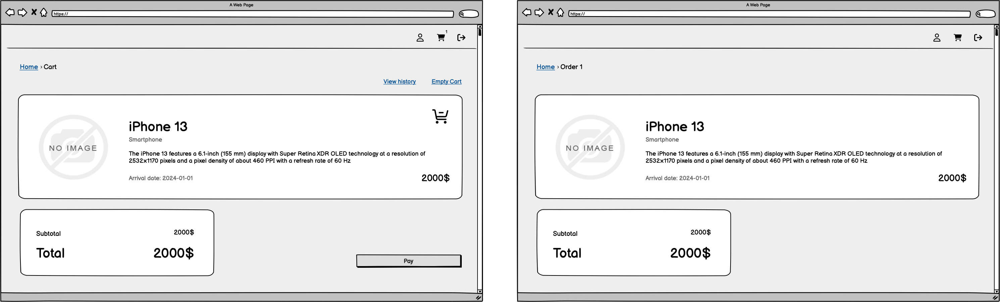
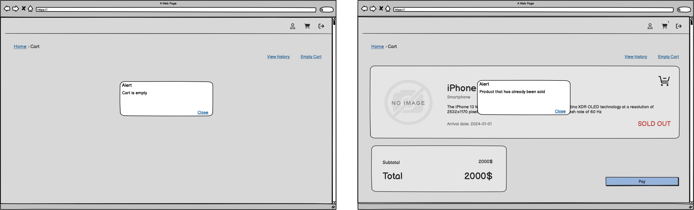
# MANAGER'S PRODUCT LIST PAGE
A list of all products. Manager's account is a bit different. Manager has no cart.
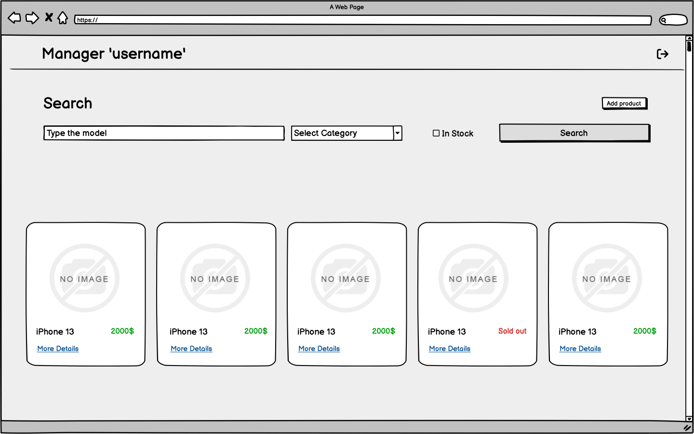
# MANAGER'S PRODUCT PAGE
The manager can mark the selected product as sold.
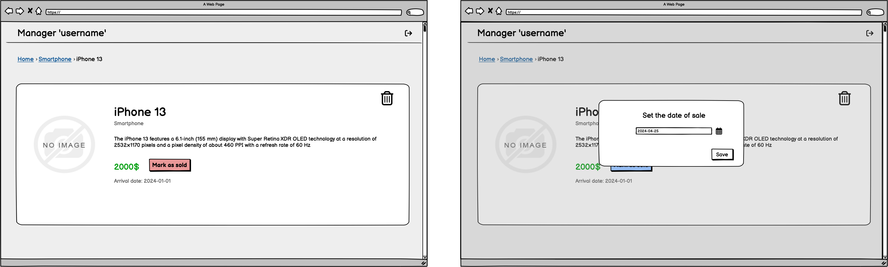
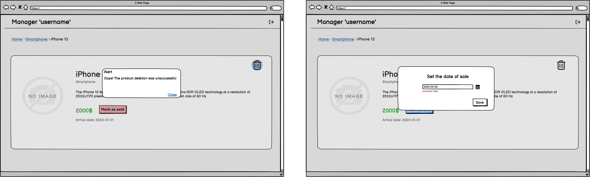
# MANAGER's PRODUCT CREATION PAGE
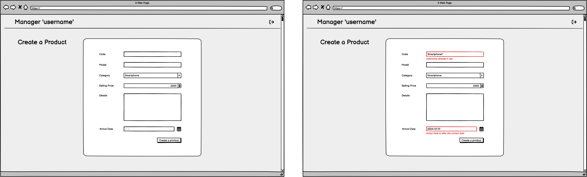
# MANAGER's PRODUCT REGISTRATION PAGE
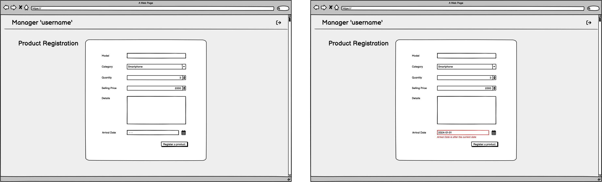
# MANAGE USERS PAGE
The Admin can search, remove users.
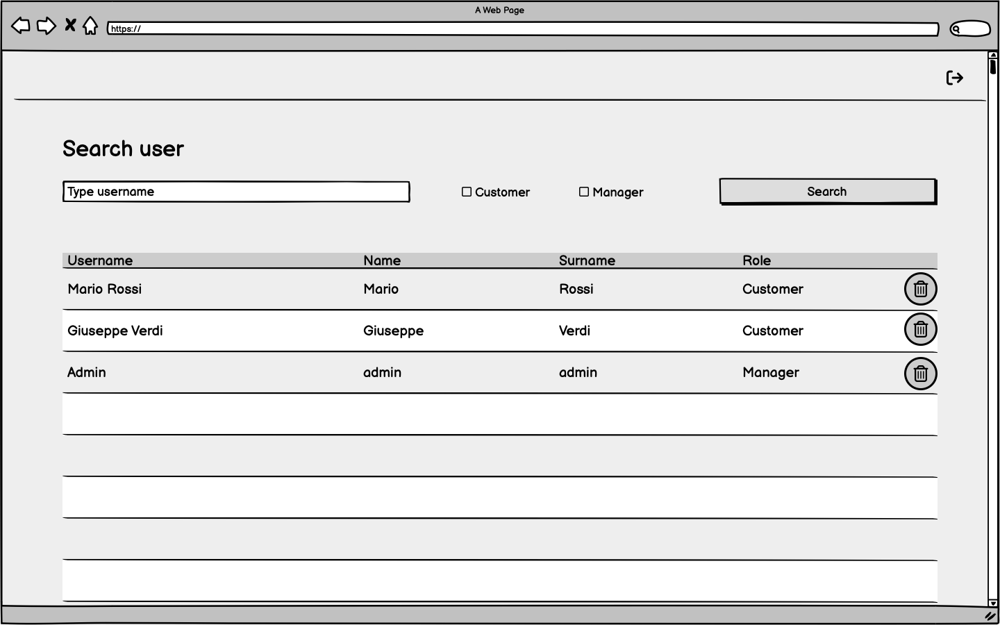
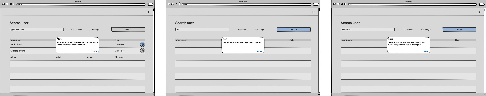
