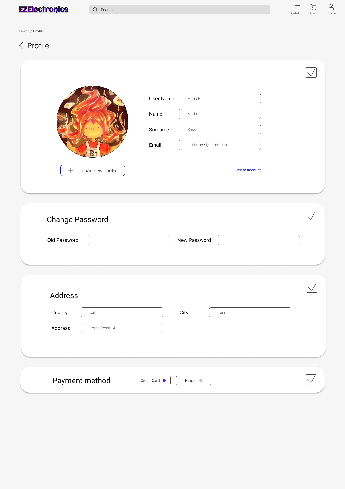

# Graphical User Interface Prototype - FUTURE

Authors: Meelad Dashti, Mohammed El Dor, Narimanova Tomiris ,Setareh Neshatdoust

Date: 04.05.2024

Version: 2.0

# LOGIN PAGE
From here the User can enter Username, Password.
 <!-- blank line -->
1. Click the "Log In" button to go to the [HOME PAGE USER](#home-page)
2. Click the "Forgot password?" button to go to the [FORGOT PASSWORD PAGE](#forgot-password-page)
3. Click the "Create new account" button to go to the [REGISTRATION PAGE](#registration-page)
4. Click the "Remember me" button. Your browser will save a cookie so that the next time you go back to the site, you will automatically be logged in if you close out the window without signing out.
 <!-- blank line -->
| | |
|:-:|:-:|

# FORGOT PASSWORD PAGE
The user can reset the password using your contact email address.
<!-- blank line -->
1. Click the "Send" button to reset password. An email will be sent with instructions to reset your password.
2. Click the "Log In" button to go to the [LOGIN USER](#login-page)
 <!-- blank line -->

# REGISTRATION PAGE
The non-registered User enters required fields, select user role (Customer or Manager) to create an account.
<!-- blank line -->
1. Click the "Sign UP" button to go to the [HOME PAGE USER](#home-page)
2. Click the "Log In" button to go to the [LOGIN USER](#login-page)
 <!-- blank line -->

| | |
|:-:|:-:|

# USER PROFILE PAGE
The user can change personal information by selecting one of the blocks.
<!-- blank line -->
1. Click on the edit icon in the right corner of the block.
2. Click the "Delete account". The account will be removed
<!-- blank line -->
| | |
|:-:|:-:|

# HOME PAGE
Main page of the website.
<!-- blank line -->
1. By clicking on the search bar, the user can search for a product by model.
2. Select a category to go to [PRODUCT LIST PAGE](#product-list-page)
3. Click on the product in the "Promotion" section to go to [PRODUCT CARD PAGE](#product-card-page)
4. Click the profile icon to go to the [USER PROFILE PAGE](#user-profile-page)
5. Click the cart icon to go to the [CART PAGE](#cart-page)
6. Click the catalog icon to go to the [HOME PAGE](#home-page)
<!-- blank line -->

# PRODUCT LIST PAGE
A list of all products in a certain category.
<!-- blank line -->
1. By clicking on the back icon to go to the [HOME PAGE](#home-page)
2. Select a way to sort the products
3. Filter by price and "in stock"
4. Click on the product to go to [PRODUCT CARD PAGE](#product-card-page)
5. Click "Add to cart" button on the product to instantly add the product to the cart
6. Click heart icon on the product to instantly add the product to the wish list
<!-- blank line -->

# PRODUCT CARD PAGE
<!-- blank line -->
1. By clicking on the back icon to go to previous page
2. Select a color of the products
3. Select the delivery service
4. Click "Add to cart" button to add the product to the cart
5. Click "Add to favorites" button on the product to add the product to the wish list
<!-- blank line -->
| | |
|:-:|:-:|

# CART PAGE
<!-- blank line -->
1. By clicking on the back icon to go to previous page
2. Click "Select All" to select all items in the cart
3. Click "Remove" button to remove selected item from the cart
4. Click "View purchases" button to go to [CART HISTORY PAGE](#cart-history-page)
5. Click "Checkout" button to go to [CART ORDERING PAGE](#cart-ordering-page)
<!-- blank line -->
| | |
|:-:|:-:|

# CART HISTORY PAGE
<!-- blank line -->
1. By clicking on the selected paid order, you will receive information about the order.
<!-- blank line -->
| | |
|:-:|:-:|

# CART ORDERING PAGE
The User enters required fields.
<!-- blank line -->
1. Click "Proceed to Pay" button to go to [PAYMENT PAGE](#payment-page)
<!-- blank line -->

# PAYMENT PAGE
In case of a successful and unsuccessful transaction, the following pages will be displayed.
| | |
|:-:|:-:|

# MANAGER PRODUCT LIST PAGE
A list of all products in a certain category. Manager's account is a bit different. The manager can create a product and has a new filter. Manager has no cart and wish list.
<!-- blank line -->
1. Click "Add product" button to go to the [MANAGER PRODUCT CREATION PAGE](#manager-product-creation-page)
2. By clicking on the back icon to go to the [HOME PAGE](#home-page)
3. Select a way to sort the products
4. Filter by price and "in stock"
5. Click on the product to go to [MANAGER PRODUCT PAGE](#manager-product-page)
6. Click "Add to cart" button on the product to instantly add the product to the cart
7. Click heart icon on the product to instantly add the product to the wish list
<!-- blank line -->

# MANAGER PRODUCT PAGE
The manager can edit and mark the selected product as sold.
| | |
|:-:|:-:|

# MANAGER PRODUCT CREATION PAGE
The Manager enters required fields and click "Save" button

# MANAGE USERS PAGE
The Admin can search, edit, remove, block/unblock the user.

